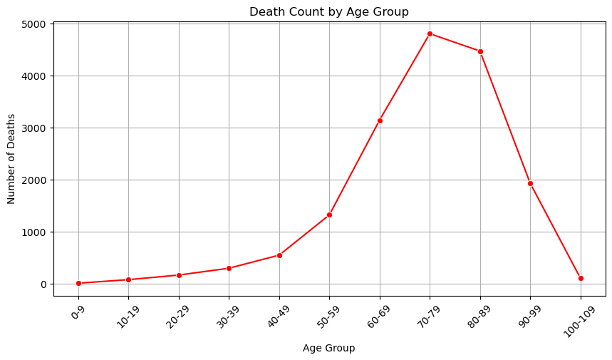

# Covid Vaccine Adverse Reaction Analysis 2020-2024

## Introduction
This project analyzes adverse reactions to vaccines using a dataset that includes patient demographics, vaccine manufacturers, geographic distribution, and gender-based reactions. The analysis aims to identify trends in adverse reactions and fatalities associated with vaccinations.

## Table of Contents
- [Introduction](#introduction)
- [Age Analysis](#1-age-analysis)
- [Vaccine Manufacturer Analysis](#2-vaccine-manufacturer-analysis)
- [Location Analysis](#3-location-analysis)
- [Gender Analysis](#4-gender-analysis)
- [Summation](#summation)
  

The code is structured into four main areas:
1. **Age Analysis** - Examines the distribution of adverse reactions and deaths by age group.
2. **Vaccine Manufacturer Analysis** - Compares adverse reactions and deaths across different vaccine manufacturers.
3. **Location Analysis** - Evaluates state-wise distribution of adverse reactions.
4. **Gender Analysis** - Analyzes how adverse reactions and deaths differ by gender.

Each section includes data processing, statistical analysis, and visual representations to summarize findings effectively.

### 1. Age Analysis
- Findings:
  - Adverse reactions were analyzed by age group.
  - Death rates were calculated for each age range.
  - A percentage-based comparison of deaths against adverse reactions was conducted.
- Graphics:
  - 
  - 
  - 

### 2. Vaccine Manufacturer Analysis
- Findings:
  - Vaccine manufacturers were compared based on adverse reaction rates.
  - Total vaccines administered vs. adverse reactions were analyzed.
  - Unknown case percentages were computed per manufacturer.
- Graphics:
  - 

### 3. Location Analysis
- Findings:
  - State-wise distribution of adverse reactions was assessed.
  - Age-group distribution by state was mapped.
  - Special focus was given to Mississippi's adverse reaction distribution.
- Graphics:
  - 

### 4. Gender Analysis
- Findings:
  - Adverse reactions were analyzed for males, females, and unknown gender.
  - Death rates by gender were calculated and compared.
- Graphics:
  - 
  - 

## Summation
This study presents a comprehensive analysis of vaccine adverse reactions based on **age, manufacturer, location, and gender**. The key takeaways include:
- Higher adverse reaction rates were observed in older age groups.
- There was no difference in reaction rates between differenct vaccine manufactures.
- State distributions varied significantly depending on state population.
- Gender-based differences in adverse reactions and death rates were identified. Females were more likely to experience adverse reaction, however men were more likely to die from adverse reactions.

By utilizing statistical analysis and visual storytelling, this project provides valuable insights into vaccine safety and adverse reaction trends. The findings can help inform public health policies and vaccine administration strategies.

This README serves as a guide for bootcamp participants to navigate the dataset and analysis workflow effectively.

## Technologies Used 

Python (pandas, pathlib/path), Junyper Notebook, csv file

## Team Members 

William Robertson, 
Sandra Salazar, 
Lance Cannon, 
Eli Crawley, 
Luke Roberts

## Data Sources

Vaccine Adverse Event Reporting System. 2024. VAERS 
https://vaers.hhs.gov/ 

COVID-19 World Vaccine Adverse Reactions - Ayush Garg. 2024 
https://www.kaggle.com/datasets/ayushggarg/covid19-vaccine-adverse-reactions?resource=download&select=VAERSVAX.csv 

Centers for Disease Control and Prevention. 2023. "COVID-19 Vaccine Effectiveness." CDC. 
https://www.cdc.gov/coronavirus/2019ncov/vaccines/effectiveness.html 

OpenAI. "ChatGPT-generated content about vaccine statistics." ChatGPT, 6 Feb. 2024 
https://openai.com 
